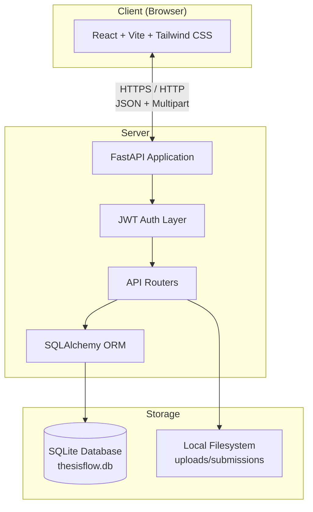
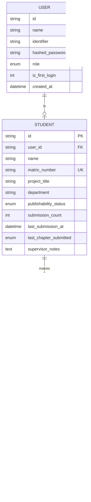
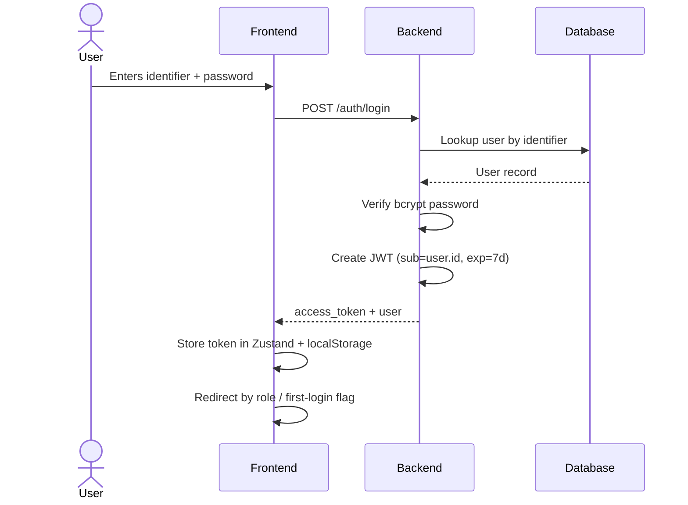
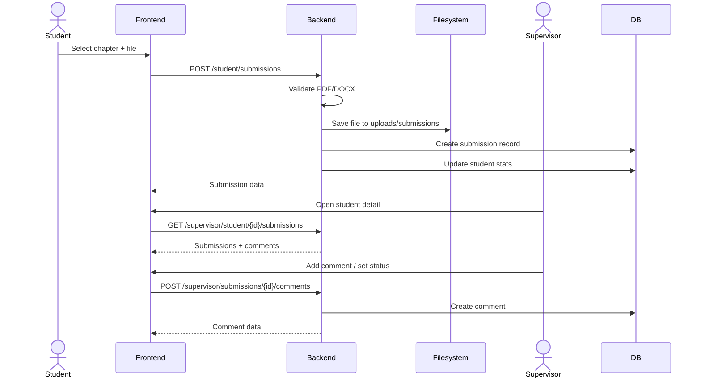

# ThesisFlow

A full-stack web application for tracking final-year thesis and project submissions between supervisors and students. Supervisors can manage students, review submissions, leave feedback, and track publishability. Students can upload chapters/drafts and view supervisor comments.

---

## Table of Contents

1. [System Architecture](#system-architecture)
2. [Tech Stack](#tech-stack)
3. [Database Design](#database-design)
4. [Application Flow](#application-flow)
5. [Security](#security)
6. [Backend](#backend)
7. [Frontend](#frontend)
8. [API Reference](#api-reference)
9. [Setup & Installation](#setup--installation)
10. [Environment Variables](#environment-variables)
11. [Deployment Notes](#deployment-notes)

---

## System Architecture



### Architecture Overview

- **Single-tenant monolith**: One FastAPI backend serves one React frontend.
- **Stateless API**: Authentication is JWT-based; no server-side sessions.
- **SQLite database**: Simple file-based relational database, suitable for internal/small-scale use.
- **Local file storage**: Student submissions are stored on disk and served as static files.

---

## Tech Stack

### Backend

| Technology | Purpose |
|------------|---------|
| **Python 3.10+** | Runtime language |
| **FastAPI 0.115+** | Web framework / API |
| **Uvicorn** | ASGI server |
| **SQLAlchemy 2.0+** | ORM |
| **SQLite** | Database |
| **Pydantic v2** | Request/response validation |
| **python-jose** | JWT encoding/decoding |
| **passlib + bcrypt** | Password hashing |
| **openpyxl** | Excel import |
| **python-multipart** | File upload parsing |

### Frontend

| Technology | Purpose |
|------------|---------|
| **React 19** | UI library |
| **TypeScript** | Type safety |
| **Vite 8** | Build tool / dev server |
| **Tailwind CSS 4** | Utility-first styling |
| **shadcn/base-ui** | Headless UI primitives |
| **Zustand** | Client state management |
| **React Router v7** | Routing |
| **React Hook Form + Zod** | Forms and validation |
| **Axios** | HTTP client |
| **date-fns** | Date formatting |
| **xlsx** | Excel parsing in browser |

---

## Database Design



### Tables

#### `users`

| Column | Type | Notes |
|--------|------|-------|
| `id` | UUID string | Primary key |
| `name` | String | Display name |
| `identifier` | String | Unique; matric for students, email/username for supervisors |
| `hashed_password` | String | Bcrypt hash |
| `role` | Enum | `supervisor` or `student` |
| `is_first_login` | Integer (0/1) | Forces password change on first login |
| `created_at` | DateTime | Account creation time |

#### `students`

| Column | Type | Notes |
|--------|------|-------|
| `id` | UUID string | Primary key |
| `user_id` | FK → users.id | One-to-one with user |
| `name` | String | Redundant with users.name for convenience |
| `matric_number` | String | Unique student identifier |
| `project_title` | String | Thesis/project title |
| `department` | String | Department/faculty |
| `publishability_status` | Enum | `publishable`, `not_publishable`, `needs_further_work`, `disapproved`, or null |
| `submission_count` | Integer | Cached count of submissions |
| `last_submission_at` | DateTime | Last upload timestamp |
| `last_chapter_submitted` | Enum | Most recently uploaded chapter |
| `supervisor_notes` | Text | General supervisor feedback |

#### `submissions`

| Column | Type | Notes |
|--------|------|-------|
| `id` | UUID string | Primary key |
| `student_id` | FK → students.id | Submission owner |
| `chapter_label` | Enum | `Chapter 1`–`Chapter 5`, `Full draft`, `Other` |
| `file_url` | String | Relative path to stored file |
| `file_name` | String | Original filename |
| `file_type` | String | `pdf` or `docx` |
| `file_size_bytes` | Integer | File size |
| `student_note` | Text | Optional message from student |
| `uploaded_at` | DateTime | Upload timestamp |

#### `comments`

| Column | Type | Notes |
|--------|------|-------|
| `id` | UUID string | Primary key |
| `submission_id` | FK → submissions.id | Related submission |
| `author_name` | String | Usually "Supervisor" |
| `body` | Text | Comment text |
| `created_at` | DateTime | Comment timestamp |

---

## Application Flow

### Authentication Flow



### Supervisor Flow

1. **Login** as supervisor (identifier + password).
2. **Dashboard** shows stats: total students, submissions, pending reviews, publishable count.
3. **Upload Students** via Excel bulk import or single-student form.
4. **Student List** shows all students with last submission, chapter, and publishability status.
5. **Student Detail** opens on click:
   - View profile and project title.
   - Set publishability status (Approve / Needs Work / Disapprove).
   - Write general supervisor notes.
   - View submissions and download files.
   - Add per-submission comments.

### Student Flow

1. **Login** as student with matric number + default password.
2. **First login** forces password change.
3. **Dashboard** shows personal submissions and upload form.
4. **Upload Submission** selects chapter/draft, PDF/DOCX file, optional note.
5. **Submission Detail** shows file info and supervisor comments.

### Submission & Review Flow



---

## Security

### Authentication

- **JWT tokens** are issued on successful login.
- Tokens expire after **7 days** by default.
- Tokens contain the user ID (`sub`) and are signed with `SECRET_KEY`.
- The frontend stores the token in **Zustand + localStorage** and attaches it to every request via an Axios interceptor.
- The backend validates the token on every protected route via `HTTPBearer` dependency.

### Authorization

- Role-based access control using `require_supervisor` and `require_student` dependencies.
- Supervisors can access supervisor-only routes; students cannot.
- Students can only access their own submissions by matching `current_user.id` → `student.user_id`.

### Passwords

- Passwords are hashed with **bcrypt** using PassLib.
- Default student password is `Caleb123` (imported students and seeded test students).
- Default supervisor password is `password123` for seeded supervisors.
- `is_first_login` flag forces students to change password on first login.
- Change password requires the current password.

### File Uploads

- Only **PDF** and **DOCX** files are accepted.
- Files are stored outside the web root in `uploads/submissions/`.
- Stored filenames are UUIDs to prevent path traversal and filename collisions.
- Original filenames are preserved for display/download.
- Files are served statically at `/uploads`.

### CORS

- CORS is configured to allow `http://localhost:5173` and `http://localhost:3000` in development.
- In production, update `allow_origins` in `backend/main.py` to the deployed frontend URL.

### Known Security Considerations

- `SECRET_KEY` is hardcoded for development. **Change it in production** via environment variable.
- No rate limiting is implemented.
- SQLite file is local; ensure filesystem permissions are restrictive.
- File uploads are limited by FastAPI/Starlette defaults; consider adding explicit `UploadFile` size limits.

---

## Backend

### Project Structure

```
backend/
├── main.py                 # FastAPI app, CORS, static files, seeding
├── database.py             # SQLAlchemy engine, session, Base
├── models.py               # Database models and enums
├── schemas.py              # Pydantic request/response models
├── auth.py                 # Password hashing and JWT helpers
├── dependencies.py         # Auth dependencies and role guards
├── seed.py                 # Supervisor seeding script
├── migrate.py              # One-off DB migration helper
├── requirements.txt        # Python dependencies
├── routers/
│   ├── auth.py             # Login + change password
│   ├── supervisor.py       # Supervisor-only endpoints
│   └── student.py          # Student-only endpoints
└── services/
    └── file_storage.py     # File upload helper
```

### Startup Behavior

1. `Base.metadata.create_all()` creates missing tables.
2. Seed data runs via `@app.on_event("startup")`:
   - Creates supervisor accounts if they do not exist.
3. Static files for uploads are mounted at `/uploads`.

### Key Routers

| Router | Prefix | Guard |
|--------|--------|-------|
| `auth` | `/auth` | None |
| `supervisor` | `/supervisor` | Supervisor role |
| `student` | `/student` | Student role |

---

## Frontend

### Project Structure

```
frontend/
├── src/
│   ├── App.tsx             # Route definitions
│   ├── main.tsx            # React entry
│   ├── index.css           # Tailwind theme + colors
│   ├── store/
│   │   └── authStore.ts    # Zustand auth state
│   ├── lib/
│   │   ├── api/            # API clients (auth, student, supervisor)
│   │   ├── constants.ts    # App constants
│   │   └── error.ts        # Error message helper
│   ├── types/
│   │   └── index.ts        # TypeScript types
│   ├── router/
│   │   ├── ProtectedRoute.tsx
│   │   └── RoleRoute.tsx
│   ├── components/
│   │   ├── layout/         # AppShell, Sidebar, Topbar, PageWrapper
│   │   ├── shared/         # StatusBadge, ChapterBadge, FileTypeBadge, etc.
│   │   └── supervisor/     # StudentTable
│   └── pages/
│       ├── auth/           # LoginPage, ChangePasswordPage
│       ├── supervisor/     # Dashboard, Upload, StudentProject, Settings
│       └── student/        # Dashboard, SubmissionDetail, Settings
├── @/                      # shadcn/base-ui components
└── package.json
```

### Routing

| Route | Role | Page |
|-------|------|------|
| `/login` | Public | Login |
| `/change-password` | Authenticated | Change Password |
| `/supervisor/dashboard` | Supervisor | Supervisor Dashboard |
| `/supervisor/upload-students` | Supervisor | Upload Students |
| `/supervisor/student/:id` | Supervisor | Student Detail |
| `/supervisor/settings` | Supervisor | Supervisor Settings |
| `/student/dashboard` | Student | Student Dashboard |
| `/student/submission/:id` | Student | Submission Detail |
| `/student/settings` | Student | Student Settings |

### State Management

- **Auth**: Zustand store persisted to `localStorage` as `tf-auth`.
- **Axios interceptors**: Attach token to requests; redirect to `/login` on 401.

---

## API Reference

### Auth

| Method | Endpoint | Description |
|--------|----------|-------------|
| `POST` | `/auth/login` | Login with identifier + password |
| `POST` | `/auth/change-password` | Change current user's password |

### Supervisor

All endpoints require `Authorization: Bearer <supervisor-token>`.

| Method | Endpoint | Description |
|--------|----------|-------------|
| `GET` | `/supervisor/dashboard` | Dashboard stats |
| `GET` | `/supervisor/students` | List all students |
| `POST` | `/supervisor/student` | Create a single student |
| `GET` | `/supervisor/student/{id}` | Student detail |
| `GET` | `/supervisor/student/{id}/submissions` | Student's submissions |
| `PUT` | `/supervisor/student/{id}/publishability` | Update publishability status |
| `PUT` | `/supervisor/student/{id}/notes` | Update supervisor notes |
| `POST` | `/supervisor/upload-students` | Bulk import from Excel |
| `GET` | `/supervisor/submissions/{id}/comments` | Comments for a submission |
| `POST` | `/supervisor/submissions/{id}/comments` | Add comment to submission |

### Student

All endpoints require `Authorization: Bearer <student-token>`.

| Method | Endpoint | Description |
|--------|----------|-------------|
| `GET` | `/student/submissions` | List own submissions |
| `POST` | `/student/submissions` | Upload a submission |
| `GET` | `/student/submissions/{id}` | Submission detail |
| `GET` | `/student/submissions/{id}/comments` | Comments for submission |

---

## Setup & Installation

### Prerequisites

- Python 3.10+
- Node.js 20+
- npm or equivalent

### Backend Setup

```bash
cd backend
python -m venv venv
source venv/bin/activate        # Windows: venv\Scripts\activate
pip install -r requirements.txt

# Optional: run migration if pulling new code with DB schema changes
python migrate.py

# Run server
uvicorn main:app --reload --host 0.0.0.0 --port 8000
```

Backend will be available at `http://localhost:8000` and API docs at `http://localhost:8000/docs`.

### Frontend Setup

```bash
cd frontend
npm install
npm run dev
```

Frontend will be available at `http://localhost:5173`.

### Default Logins (after seeding)

| Role | Identifier | Password |
|------|------------|----------|
| Supervisor | `supervisor` | `password123` |
| Supervisor | `supervisor@university.edu` | `password123` |
| Student | Any imported matric | `Caleb123` |

---

## Environment Variables

Create a `.env` file in the project root for the frontend, and optionally one in `backend/` for backend secrets.

### Frontend `.env`

```env
VITE_API_BASE_URL=http://localhost:8000
```

### Backend `.env` (optional, defaults in code)

```env
SECRET_KEY=your-production-secret-key
ACCESS_TOKEN_EXPIRE_MINUTES=10080
```

> **Important:** Change `SECRET_KEY` before deploying to production.

---

## Deployment Notes

### Backend

- Use a production ASGI server such as Gunicorn with Uvicorn workers.
- Set `SECRET_KEY` via environment variable.
- Restrict CORS origins to the deployed frontend URL.
- Move SQLite to a persistent volume; for production consider PostgreSQL.
- Serve uploaded files via a CDN or persistent storage instead of local disk for multi-server deployments.
- Add HTTPS termination (reverse proxy like Nginx or Caddy).

### Frontend

- Build for production:

```bash
cd frontend
npm run build
```

- Serve the contents of `frontend/dist/` with a static file server or CDN.
- Ensure `VITE_API_BASE_URL` points to the production backend.

### Database Migrations

Currently the project uses lightweight schema creation (`Base.metadata.create_all`) and a manual migration helper (`backend/migrate.py`). For production, consider adopting **Alembic** for proper migration management.

---

## Contributing

- Follow the existing code style.
- Run `npm run lint` and `npm run build` in `frontend/` before committing.
- Run `python -m py_compile` on changed backend files.
- Do not commit `__pycache__`, `thesisflow.db`, `uploads/`, or `node_modules/`.
